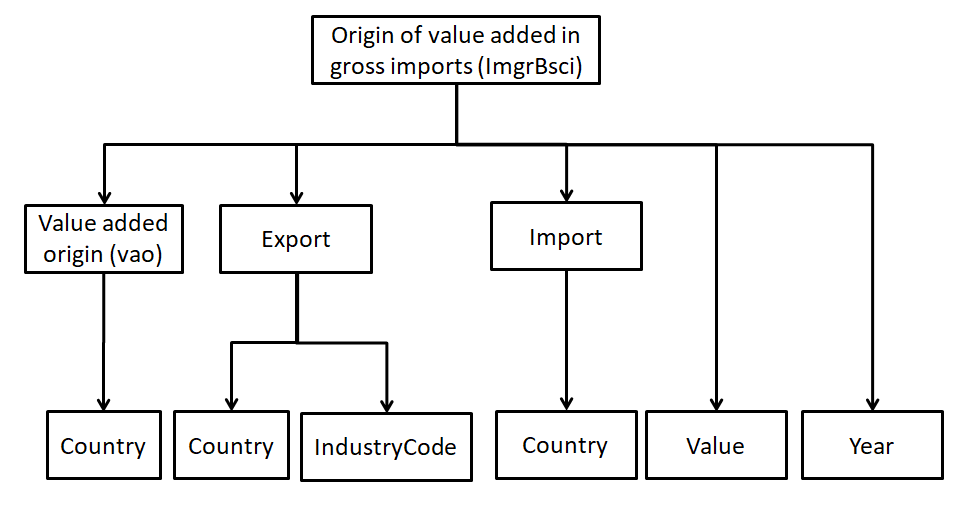
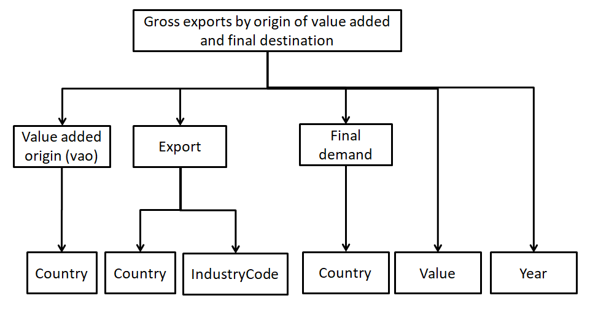
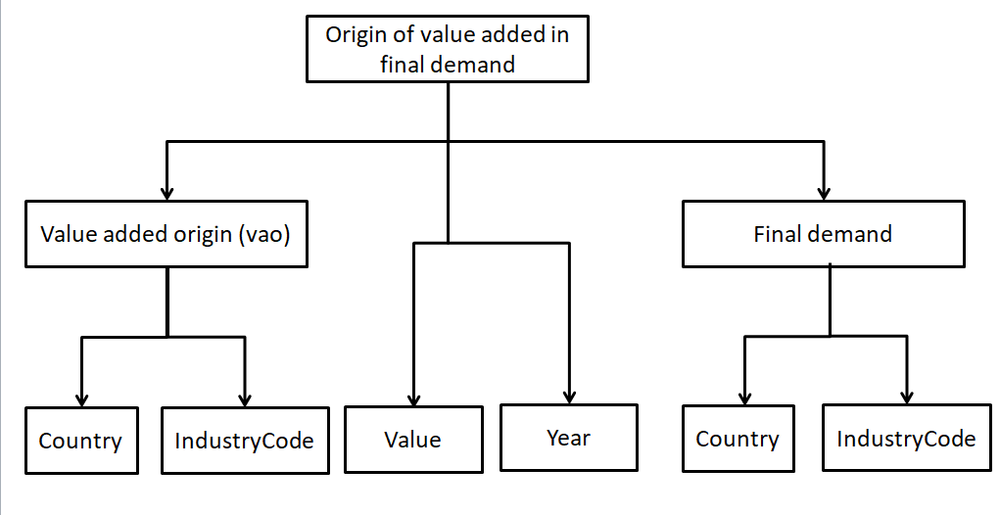

## Modeling Trade in Value Added (TiVA) 2021 indicators

The TiVA indicators represents global flows and services. It has four views [1].

 1. The origin of value added,
 2. Exporters,
 3. Importers,
 4. Final consumers.

Each of these views can be represented using tables [1]. To express TiVA 2021 indicators as an ontology, we modeled each TiVA view using tree structure design pattern. Definitions of all views are borrowed from [1].

### Origin of value added in gross exports
Origin of value added in gross exports provides estimates of total gross exports by exporting industry i in country **c** broken down by the value added generated by source industry **h** in country **p** (see page 40 in [1]).

Figure 1. Origin of value added in gross exports tree structure.

### Origin of value added in gross imports
Origin of value added in gross imports provides estimates of the value added in gross  imports by country **c** of goods and services from industry i originating from partner country/region **p** broken down by value added originating from country/region **s** (see page 41 in [1]).

Figure 2. Origin of value added in gross imports tree structure.

### Gross exports by origin of value added and final destination

This indicator presents gross exports of final and intermediate products by industry i in country **c**, broken down by both the source country/region **s** origin of value added and, according to final demand destination country/region **p** (see page 44 in [1]).

Figure 3. Gross exports by origin of value added and final destination tree structure.

### Origin of value added in final demand
Origin of value added in final demand provides estimates of value added for final demand in country **p** for industry **h** final goods and services broken down by the value added generated by source industry **i** in VA source country **c** (see page 42 in [1]).

Figure 4. Origin of value added in final demand tree structure.

 # Publication

 1. Guide to OECD TiVA Indicators, 2021 edition. Online available: https://www.oecd-ilibrary.org/science-and-technology/guide-to-oecd-tiva-indicators-2021-edition_58aa22b1-en