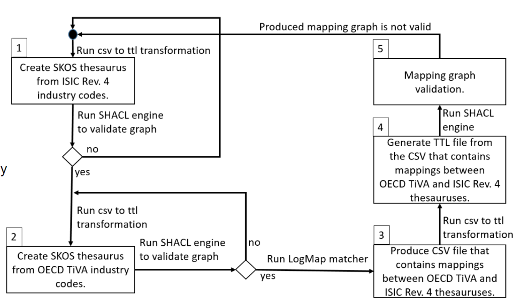

# Automated mappings in CoyPu project

This folder contains explanation of a mapping between 
[International Standard Industrial Classification of all Economic Activities (ISIC) Rev 4](https://www.fao.org/statistics/caliper/tools/download/en) and 
[Trade in Value Added (TIVA)](https://www.oecd.org/sti/ind/measuring-trade-in-value-added.htm) classification schemas workflow. 
Mapping is generated automatically using [LogMap matcher tool](https://git.tib.eu/terminology/sandbox/logmap-matcher) and [RDFizer](https://github.com/SDM-TIB/SDM-RDFizer) tools.

## Mappings between ISIC-4 and TIVA-21 classifications

Producing and validating the mapping between ISIC Rev 4 and TIVA 21 classifications workflow is depicted in Figure 1. 
The workflow consists of the following five steps: 

---
1. Create SKOS vocabulary from ISIC rev 4 csv file.
2. Create SKOS vocabulary from TIVA-21 classification.
3. Produce mappings between TIVA 21 and ISIC rev 4 (csv file).
4. Generate TTL file of mappings between TIVA 21 to ISIC rev 4.
5. Graphs Validation reports.
---

#### Step1: Create SKOS vocabulary from ISIC rev 4 csv file
The ISIC Rev 4 classification schema is downloaded as a csv file from [this](https://www.fao.org/statistics/caliper/tools/download/en) page. 
The ISIC4-core.csv file is available in **isic-rev4-data** folder within this git repository.
 The [RDFizer](https://github.com/SDM-TIB/SDM-RDFizer) is used to generate TTL file from the csv file. 
 TDFizer mapping file **isic4_csv_to_ttl_mappings.ttl** is available in the **logmap-mappings** of this git repository.
 The resulting **isic4_data** TTL file is is available in **mapping** folder of this repository. 
Each node in the ISIC Rev 4 graph is instance of a **skos:Concept**. 
The [SCHAL](https://github.com/TopQuadrant/shacl) engine is used to validate ISIC Rev 4 graph 
against SKOS shapes using the following command

```
./shaclvalidate.sh -datafile isic4_data.ttl -shapesfile skos.shapes.ttl
```
If the isic4_data.ttl does not pass echecking SCHAL engine validation then all issues should be fixed.

|  | 
|:--:| 
| *Figure 1. Mapping between ISIC rev 4 and TIVA 21 classifications workflow* |


## Step 2: Create SKOS vocabulary from TIVA-21 classification

To prepare the TIVA classification for mappings starting point is [Guide to OECD TiVA Indicators, 2021 edition](https://www.oecd-ilibrary.org/science-and-technology/guide-to-oecd-tiva-indicators-2021-edition_58aa22b1-en).
Similar to the fist step, TIVA classification is created by using **Table A.3. Industry coverage** from the Guide. SHACL engine is used to
validate TIVA generated TIVA graph. The  TTL file is available 