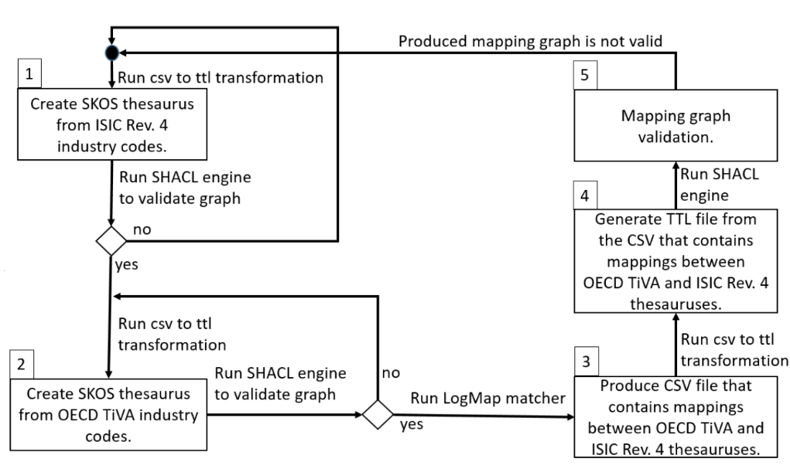

# Automated mappings in CoyPu project

This folder contains explanation of mappings between [International Standard Industrial Classification of all Economic Activities (ISIC) Rev 4](https://www.fao.org/statistics/caliper/tools/download/en) and 
[Trade in Value Added](https://www.oecd.org/sti/ind/measuring-trade-in-value-added.htm) classification schemas workflow. 
Mapping is generated automatically using [LogMap matcher tool](https://git.tib.eu/terminology/sandbox/logmap-matcher).

## Mappings between ISIC-4 and TIVA-21 classifications

## Notes